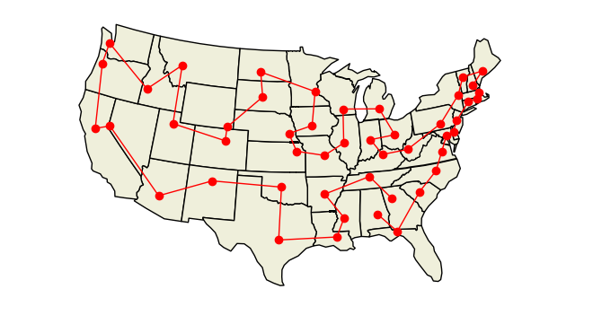

PyConcorde
==========


What is it?
-----

PyConcorde is a Python wrapper around the [Concorde TSP
solver](http://www.math.uwaterloo.ca/tsp/concorde.html).

PyConcorde allows you to compute solutions to the Traveling Salesman Problem
with just a few lines of Python code. It uses the state-of-the-art Concorde
solver and provides a convenient Python layer around it.

<p align="center">
  <a href="examples/us_state_capitals.py">
	
	</a>
</p>

Note: until commit e065497 (pre version 0.1) PyConcorde was called PyTSP. It
was renamed to emphasize the central role of the underlying Concorde solver.

How do I install it?
------
PyConcorde runs under Python 3.7 and higher and requires a UNIX-like OS 
(Native Windows not supported, but it can be run under WSL). It needs the [Concorde TSP
solver](http://www.math.uwaterloo.ca/tsp/concorde.html) and [QSOpt linear
programming library](http://www.math.uwaterloo.ca/~bico/qsopt/). Further
instructions on building/downloading those can be found below.

To build PyConcorde, clone the repository:

    git clone https://github.com/jvkersch/pyconcorde
	cd pyconcorde
	
Then run 

	pip install -e .
	
Or, alternatively, all in one line, run:

	pip install 'pyconcorde @ git+https://github.com/jvkersch/pyconcorde'
		
	
This will download and build Concorde (and its dependency QSOpt) and then build
PyConcorde. While this may take a few minutes, downloading Concorde only
happens the first time the install script is run (unless you remove the `data`
directory).

If you already have Concorde and/or QSOpt installed (or an equivalent linear
solver), you can use those instead. Simply set the environment variable
`CONCORDE_DIR` (or `QSOPT_DIR`) to point to the folder where you installed
Concorde (or QSOpt).

Detailed instructions to build Concorde can be found at [this web
page](https://github.com/perrygeo/pytsp/wiki/Installing-Solvers).

What can I do with it?
-------

PyConcorde is a very light-weight library. The main entry point is the
`TSPSolver` class. Here we use it to read in the Berlin52 dataset, a dataset of
52 locations in Berlin (part of the TSPlib test data).

```python
    >>> from concorde.tsp import TSPSolver
    >>> from concorde.tests.data_utils import get_dataset_path
    >>> fname = get_dataset_path("berlin52")
    >>> solver = TSPSolver.from_tspfile(fname)
    Problem Name: berlin52
    Problem Type: TSP
    52 locations in Berlin (Groetschel)
    Number of Nodes: 52
    Rounded Euclidean Norm (CC_EUCLIDEAN)
```    

As you can see above, PyConcorde (or rather, Concorde) is somewhat chatty and
will print various message to the standard output. Now that we have a solver
instance, let's compute a solution. On my machine this is almost instantaneous.
   
```python    
    >>> solution = solver.solve()
    (... output snipped for brevity ...)
```

Again, Concorde will display a variety of messages while it's running. The end
result is a `ComputedTour` object called `solution` with information about the
tour that we just computed:

```python
    
    >>> solution.found_tour
    True
    >>> solution.optimal_value
    7542.0
    >>> solution.tour
    array([ 0, 48, 31, 44, 18, 40,  7,  8,  9, 42, 32, 50, 10, 51, 13, 12, 46,
           25, 26, 27, 11, 24,  3,  5, 14,  4, 23, 47, 37, 36, 39, 38, 35, 34,
           33, 43, 45, 15, 28, 49, 19, 22, 29,  1,  6, 41, 20, 16,  2, 17, 30,
           21], dtype=int32)
    
```

Other TSP solvers for Python
----------------------------

Several other TSP implementations exist. The following are written in pure
Python:

- [tsp-solver](https://github.com/dmishin/tsp-solver)
- [python-tsp](https://github.com/fillipe-gsm/python-tsp)

If you have another TSP algorithm that can be called from within Python, and
you want to have it added here, please open an issue.

Technical Notes
-------

PyConcorde needs Concorde and QSOpt. Downloading and building these packages
should happen automatically on Linux/Mac OS, but please file an issue if you
experience any trouble during this step.

Note that Windows is currently unsupported. If you get the library to work on
Windows, please open a ticket to describe any tweaks (or better yet, a Pull
Request).

License
-----

PyConcorde is licensed under the [Modified BSD license](COPYING). Note that
Concorde and QSOpt are released under different licenses, and that PyConcorde
does not include any code from these packages.
